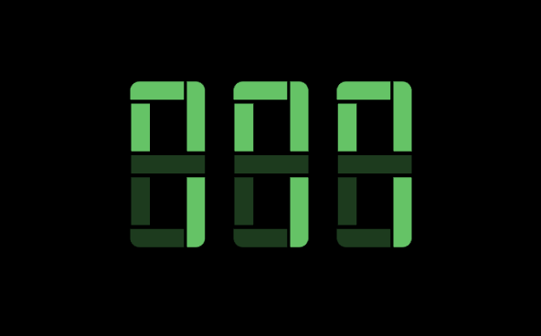
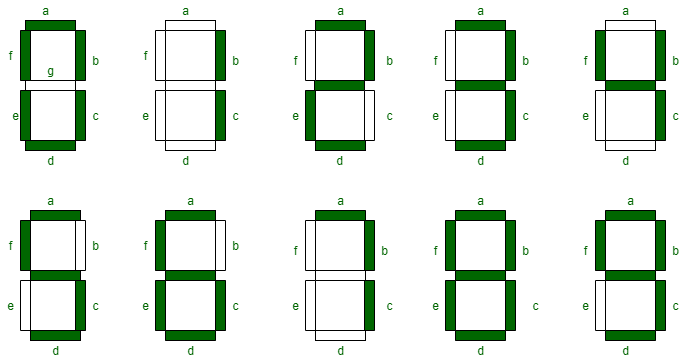

# SegmentDisplay

⚠️ This project is not complete yet!

## Preview



## Usage

```Swift
import SegmentDisplay

struct ContentView: View {
    @State var num = 300

    var body: some View {
        SegmentDisplay(digits: 3, num: $num)
    }
}
```

```Swift
import SegmentDisplay

struct ContentView: View {
    @State var num = 5

    var body: some View {
        Segment(num: $num)
    }
}

## Todo 

- [ ] italic 
- [ ] `acccentColor` Modifier
- [ ] `style` variation(flat, ~~ round ~~)


